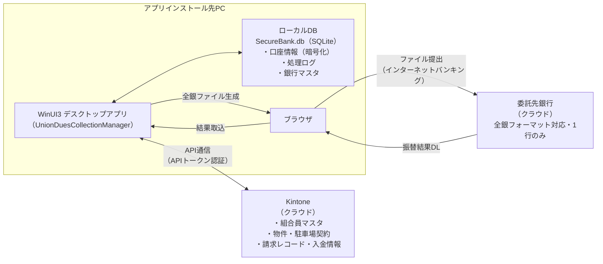

# 第1章 システム概要

---

## 1-1. システム管理者の責務

| 作業カテゴリ | 具体的な作業 |
|------------|------------|
| **環境構築** | インストール、初期設定、Kintone接続設定 |
| **ユーザー管理** | 事務局からの依頼を受けてKintoneユーザーを追加・無効化 |
| **セキュリティ** | 暗号化キーの保護、APIトークンの管理・更新 |
| **バックアップ** | 定期バックアップの取得・保管 |
| **PC移行** | PC載せ替え時のバックアップ→新環境セットアップ→リストア |
| **障害対応** | ログ解析、DB修復、事務局からの問い合わせ対応 |

事務局が行う日常的なデータ入力（Kintoneへの組合員登録・口座登録など）はシステム管理者の担当外です。

---

## 1-2. システム構成



- **ローカルDB**：組合員の口座情報・処理ログ・銀行マスタを暗号化して保存
- **Kintone**：組合員マスタ・物件所有状況・駐車場契約・請求レコードを管理
- **全銀ファイル**：締め処理で生成し、銀行に提出するファイル（PC上に保存）

---

## 1-3. 重要ファイルの場所と説明

### ローカルデータ（PC上）

| ファイル | パス | 取り扱い |
|---------|------|---------|
| **データベース** | `%LOCALAPPDATA%\UnionDuesCollectionManager\SecureBank.db` | バックアップ対象。直接コピーによるPC移行は不可 |
| **暗号化キー** | `%APPDATA%\AccountReconciler\secret.key` | **絶対に削除・移動しない**。バックアップ機能で自動管理 |
| **APIトークン** | `%LOCALAPPDATA%\AccountReconciler\kintone_api_tokens.json` | 第三者に見せない。gitにコミットしない |
| **アプリID設定** | `%LOCALAPPDATA%\AccountReconciler\kintone_app_ids.json` | Kintone構成変更時のみ更新 |
| **Kintone設定** | `%LOCALAPPDATA%\AccountReconciler\kintone_config.json` | ドメイン等の接続情報 |
| **ログ** | `%LOCALAPPDATA%\UnionDuesCollectionManager\logs\` | 日付別テキストファイル。障害調査時に参照 |

> `%LOCALAPPDATA%` = `C:\Users\（ユーザー名）\AppData\Local`
> `%APPDATA%` = `C:\Users\（ユーザー名）\AppData\Roaming`

### アプリケーション本体

インストール先フォルダ内の `Config\` に以下の雛形ファイルが含まれます。

| ファイル | 説明 |
|---------|------|
| `Config\kintone_app_ids.json` | アプリID設定の雛形（インストール時の初期値） |
| `Config\kintone_api_tokens.json` | APIトークン設定の雛形（**初期値は空。要設定**） |

---

## 1-4. 設定ファイルの読み込み優先順位

同名の設定ファイルが複数箇所に存在する場合、以下の優先順位で読み込まれます。

```
優先度（高）  %LOCALAPPDATA%\AccountReconciler\  （ユーザー設定）
              ↓
優先度（低）  アプリインストールフォルダ\Config\  （インストール時の雛形）
```

通常、初回セットアップ後はユーザー設定側が使用されます。

---

[← 目次へ](index.md) ｜ [次章：インストール・初期セットアップ →](02_initial_setup.md)
