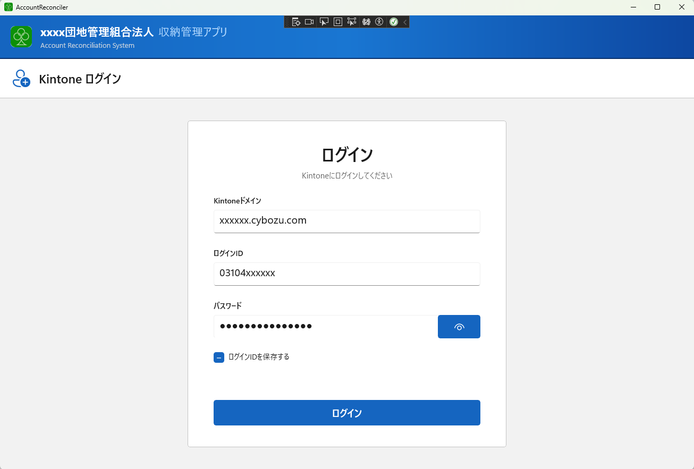
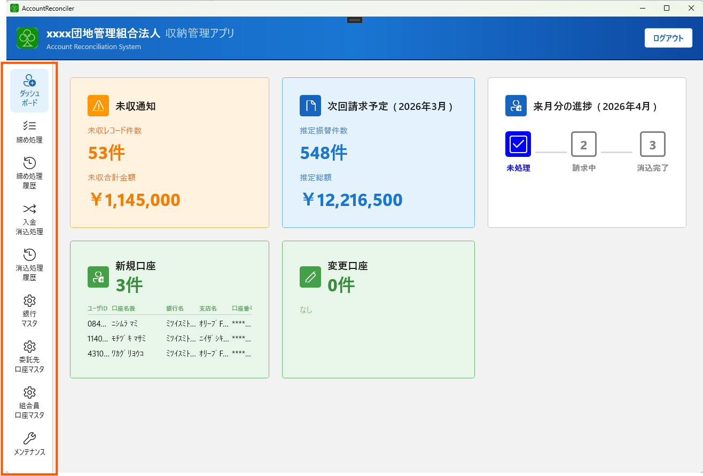
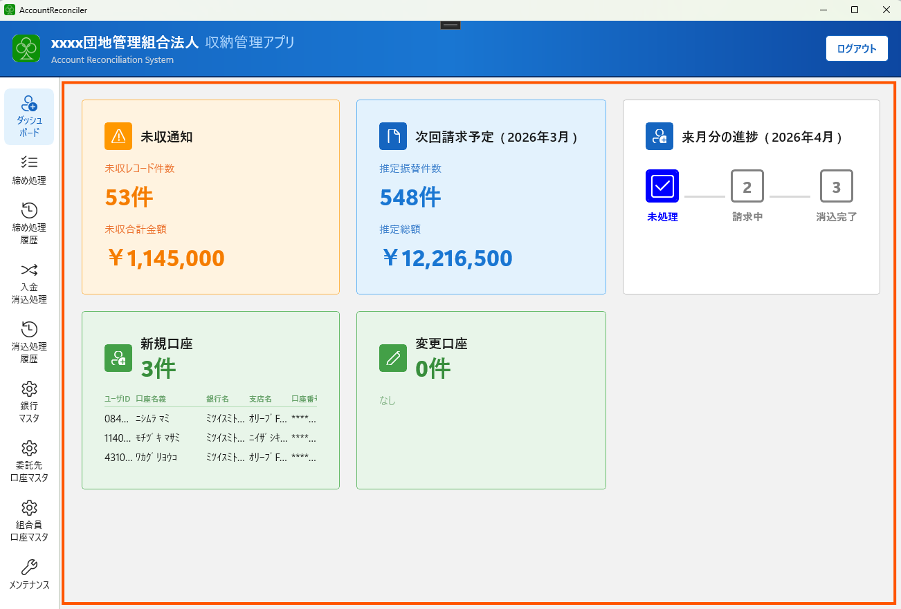

# 第1章 システム概要・基本操作

## 1-0. このシステムの構成

このシステムは、**パソコンにインストールされたアプリ**と**Kintone（クラウドサービス）**の2つが連携して動作しています。
また、銀行への全銀ファイル提出・振替結果の取込はブラウザ（Web21）を経由して行います。

```
このパソコン上
┌──────────────────────────────────────────────────────────────────┐
│                                                                  │
│  ┌─────────────────────────┐    ┌──────────────────────────────┐ │
│  │  PCアプリ                │    │  ブラウザ（Web21）            │ │
│  │                         │    │                              │ │
│  │  ・月次締め処理           │    │  ・全銀ファイルをアップロード  │ │
│  │  ・入金消込処理           │    │  ・振替結果ファイルをDL       │ │
│  │  ・マスタ管理             │    │                              │ │
│  │  ・全銀ファイル生成        │    │  ※担当者がブラウザで操作     │ │
│  │  ・窓口払い登録           │    └──────────────────────────────┘ │
│  │                         │           ↑ファイル受け渡し↓          │
│  │  ※口座情報はこのPCに保存  │    ┌──────────────────────────────┐ │
│  └─────────────────────────┘    │  三井住友銀行（クラウド）      │ │
│           ↑API通信↓              │                              │ │
│  ┌─────────────────────────┐    │  ・振替の実行                 │ │
│  │  Kintone（クラウド）      │    │  ・振替結果ファイルの提供      │ │
│  │                         │    │                              │ │
│  │  ・組合員データ           │    └──────────────────────────────┘ │
│  │  ・物件・駐車場契約データ  │                                      │
│  │  ・月次請求レコード        │                                      │
│  │  ・入金情報               │                                      │
│  │                         │                                      │
│  │  ※マスタ・請求履歴はここ  │                                      │
│  └─────────────────────────┘                                      │
└──────────────────────────────────────────────────────────────────┘
```

### 月次業務でのデータの流れ

```
【締め処理〜振替依頼】

  Kintone         PCアプリ              ブラウザ（Web21）     銀行
  （組合員・        （締め処理）            （担当者が操作）
  　物件データ）
      │                │                       │               │
      │─ 組合員情報取得 ─►│                       │               │
      │                │─ 全銀ファイル生成 ─────►│               │
      │                │                       │─ ファイル提出 ─►│
      │                │                       │               │（振替実行）


【入金消込〜Kintone反映】

  銀行              ブラウザ（Web21）     PCアプリ              Kintone
      │                │                    │                   │
      │─ 振替結果提供 ─►│                    │                   │
      │                │─ 結果ファイルDL ───►│                   │
      │                │                    │─ 消込処理 ─────────►│
      │                │                    │   （入金情報を反映） │


【窓口払い（随時）】

  PCアプリ                                               Kintone
      │─────────────────── 入金情報を手動登録 ────────────────────►│
```

### 各コンポーネントの役割

| | PCアプリ | Kintone | ブラウザ（Web21） |
|---|---|---|---|
| **何をするか** | 計算処理・ファイル生成・データ管理の操作画面 | データの保管・共有 | 銀行との全銀ファイルのやりとり |
| **保存しているデータ** | 組合員の銀行口座情報（暗号化） | 組合員情報・物件・駐車場契約・請求・入金履歴 | （保存なし） |
| **操作者** | 事務局スタッフ（このシステム） | 事務局スタッフ（Kintone画面） | 担当者（銀行サイト） |

### この構成を知っておくと役立つ場面

- **請求内容がおかしい** → まずKintone側のデータ（組合員・物件・駐車場契約）を確認する
- **PCを新しくする** → PCアプリのデータ（口座情報）を移行する必要がある（→ [第6章](06_maintenance.md)）
- **ログインできない** → Kintoneのドメイン・ID・パスワードを確認する
- **処理結果をほかのスタッフが確認したい** → Kintoneにアクセスすれば別のPCからも閲覧できる
- **振替がうまくいかない** → Web21側の操作（ファイル形式・アップロード手順）を確認する

---

## 1-1. このシステムでできること

| 機能 | 内容 |
|------|------|
| **月次締め処理** | 組合員の管理費・修繕積立費・駐車場代を計算し、全銀フォーマットのファイルを生成します |
| **入金消込処理** | 銀行の振替結果CSVを読み込み、入金済み・未入金の状態をKintoneに反映します |
| **マスタ管理** | 組合員の口座情報、銀行・支店、委託先口座を管理します |
| **バックアップ** | データベースのバックアップ・リストアを行います（PC移行時に使用） |

---

## 1-2. 月次業務フロー

```
毎月の業務スケジュール（例）

振替日の5〜7日前
  └→ [締め処理] 請求データ生成・全銀ファイル作成
  └→ 全銀ファイルを銀行へ提出

振替日の翌日〜数日後（銀行から結果ファイル受領後）
  └→ [入金消込] 振替結果CSVを読み込み・消込実行
  └→ 未入金者への対応（別途）
```

---

## 1-3. 画面一覧

### メイン画面

| 画面名 | 用途 |
|--------|------|
| **ダッシュボード** | 未収通知・次回請求予定・システムステータスの確認 |
| **締め処理** | 月次請求データの生成・全銀ファイルの作成・実行 |
| **締め処理履歴** | 過去の締め処理ログ・ファイルのダウンロード |
| **入金消込処理** | 振替結果CSVの読込・消込実行 |
| **消込処理履歴** | 過去の消込処理ログの確認 |

### マスタ管理画面

| 画面名 | 用途 |
|--------|------|
| **銀行マスタ** | 銀行コード・銀行名、支店コード・支店名の管理 |
| **委託先口座マスタ** | 振替元となる口座（委託先）の管理 |
| **組合員口座マスタ** | 組合員の銀行口座情報の管理 |

### その他

| 画面名 | 用途 |
|--------|------|
| **メンテナンス** | バックアップ・リストア、フォントサイズ変更 |
| **設定** | Kintoneのドメイン設定 |

---

## 1-4. ログイン手順

システムを起動すると、最初にログイン画面が表示されます。



1. **Kintoneドメイン** を入力します
   - 例：`yourcompany.cybozu.com`
   - ドメインが不明な場合はKintoneのURLを確認してください

2. **ログインID** を入力します（KintoneのログインID）

3. **パスワード** を入力します

4. **「ログイン」** ボタンをクリックします

> **ログインIDを保存する場合**
> 「ログインIDを保存する」チェックボックスをオンにすると、次回起動時にIDが自動入力されます。
> パスワードは保存されません。

---

## 1-5. 画面の移動方法

画面左側のナビゲーションメニューから各画面に移動できます。



- メニューのアイコンまたはラベルをクリックして切り替えます
- 現在の画面はメニュー上でハイライト表示されます

---

## 1-6. ダッシュボードの見方

ログイン後に表示されるダッシュボードには、以下の情報が表示されます。

| カード | 内容 |
|--------|------|
| **未収通知** | 未入金件数と未入金合計金額 |
| **次回請求予定** | 次回の締め処理予定に関する情報 |
| **システムステータス** | システムの状態 |



---

[← 目次へ](index.md) ｜ [次章：初期設定 →](02_initial_setup.md)
