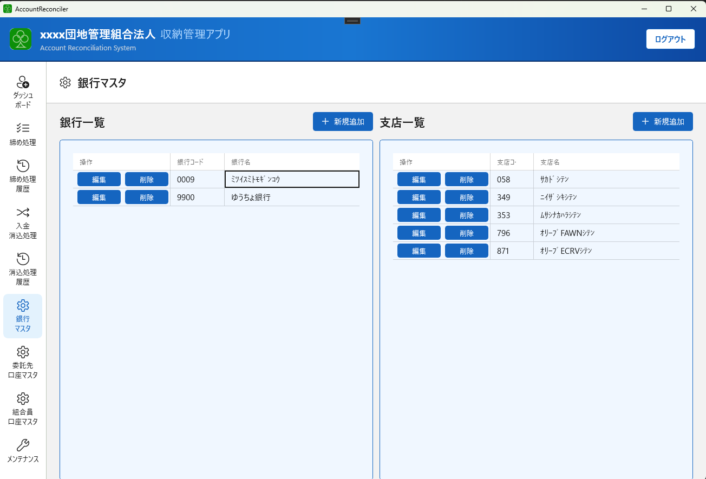
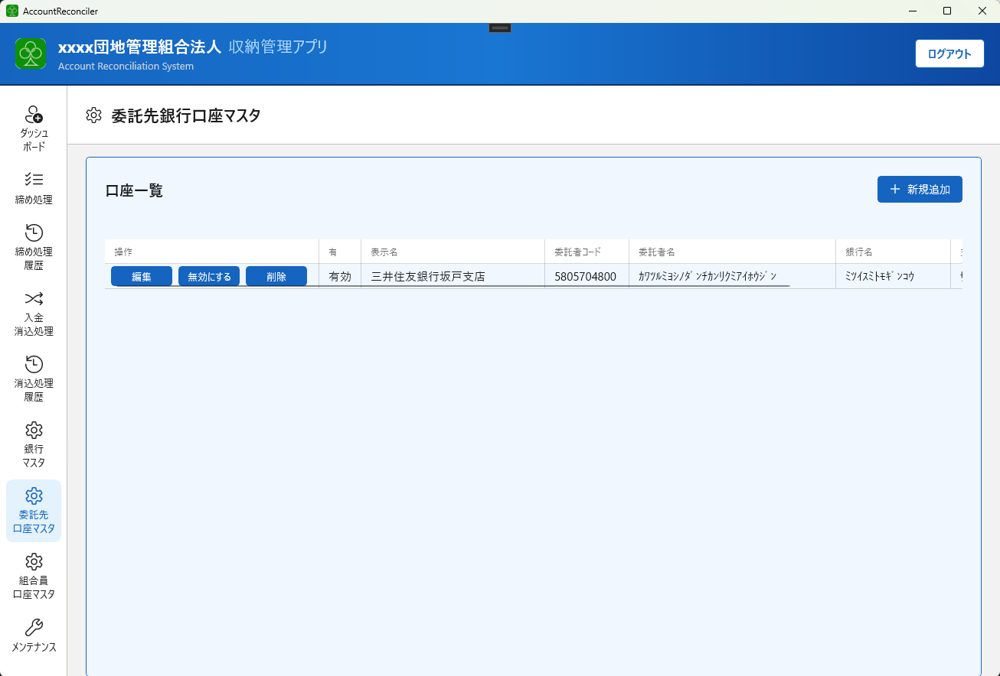
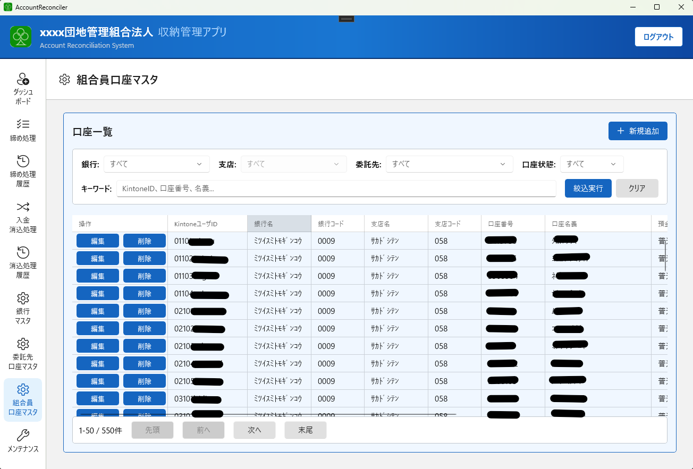
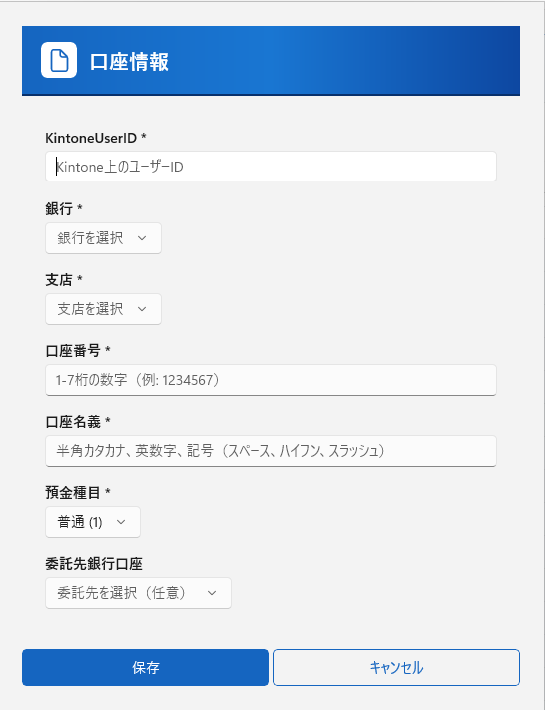

# 第2章 初期設定

システムを初めて使用する際、または環境を新しくセットアップする際の手順です。

---

## 初期設定チェックリスト

以下の順番で設定を進めてください。

- [ ] 2-1. 銀行マスタの登録
- [ ] 2-2. 委託先口座の登録
- [ ] 2-3. 組合員口座の登録

---

## 2-1. 銀行マスタの登録

全銀ファイルの銀行名・支店名を正しく出力するため、使用する銀行・支店を登録します。

### 銀行を追加する

1. 左側メニューから **「銀行マスタ」** を開きます
2. 左列「銀行一覧」の **「新規追加」** ボタンをクリックします
3. 以下を入力して **「登録」** をクリックします

| 項目 | 内容 |
|------|------|
| 銀行コード | 4桁の銀行コード（例：`0001`） |
| 銀行名 | 半角カナで入力（例：`ミツビシUFJｷﾞﾝｺｳ`） |

### 支店を追加する

1. 銀行一覧から対象の銀行を選択します（右列に支店一覧が表示されます）
2. 右列「支店一覧」の **「新規追加」** ボタンをクリックします
3. 以下を入力して **「登録」** をクリックします

| 項目 | 内容 |
|------|------|
| 支店コード | 3桁の支店コード（例：`001`） |
| 支店名 | 半角カナで入力（例：`ﾎﾝﾃﾞﾝ`） |

> **銀行名・支店名は半角カナで入力してください。**
> 全銀フォーマットの規格に合わせるため、半角カナが必要です。

---

## 2-2. 委託先口座の登録

> ※現状、複数委託先口座には対応していません。

振替の委託元となる口座情報を登録します。複数ある場合はすべて登録してください。

1. 左側メニューから **「委託先口座マスタ」** を開きます
2. **「新規追加」** ボタンをクリックします
3. 以下を入力します

| 項目 | 内容 |
|------|------|
| 表示名 | 画面上での識別名（例：「メイン口座」） |
| 委託者コード | 全銀ヘッダに使用する委託者コード（10桁） |
| 委託者名 | 全銀ヘッダに使用する委託者名（半角カナ、40文字以内） |
| 銀行コード | 振替元銀行の4桁コード |
| 支店コード | 振替元支店の3桁コード |
| 口座種別 | 普通・当座など |
| 口座番号 | 7桁の口座番号 |

4. **「登録」** をクリックします
5. 登録後、**「有効」** になっていることを確認します（無効の場合は有効/無効ボタンで切り替え）

---

## 2-3. 組合員口座の登録

組合員ごとの振替先口座情報を登録します。

1. 左側メニューから **「組合員口座マスタ」** を開きます
2. **「新規追加」** ボタンをクリックします
3. 以下を入力します

| 項目 | 内容 |
|------|------|
| Kintone ユーザーID | KintoneのユーザーID（組合員と紐付けるため必須） |
| 銀行コード | 4桁の銀行コード |
| 支店コード | 3桁の支店コード |
| 口座種別 | 普通・当座など |
| 口座番号 | 7桁の口座番号 |
| 口座名義 | 半角カナで入力 |
| 委託先口座 | 2-4で登録した委託先口座を選択 |

4. **「登録」** をクリックします

> **口座情報はセキュリティ保護のため暗号化して保存されます。**
> 登録後は画面上でも口座番号の一部がマスクされて表示されます。

### 口座状態について

新規登録した組合員口座は **「新規」** 状態になります。

| 状態 | 説明 |
|------|------|
| 新規 | 初回登録、またはKintone初回振替前の状態 |
| 有効 | 振替成功済みの通常状態 |
| 変更 | 口座情報を変更した状態（次回振替で反映） |
| 無効 | 使用停止した口座 |

初回の振替成功後に「新規」→「有効」へ自動的に遷移します。

---

## 初期設定完了後の確認

以下をダッシュボードや各マスタ画面で確認します。

- [ ] ダッシュボードが正常に表示されている
- [ ] 銀行マスタに使用する銀行・支店が登録されている
- [ ] 委託先口座が少なくとも1件「有効」状態で登録されている
- [ ] 組合員口座が登録されている（Kintoneの組合員数と一致しているか確認）

---

[← 前章：システム概要](01_overview.md) ｜ [次章：月次締め処理 →](03_monthly_billing.md)
