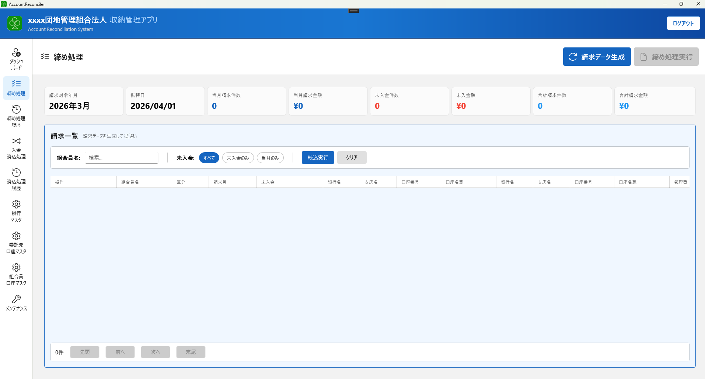
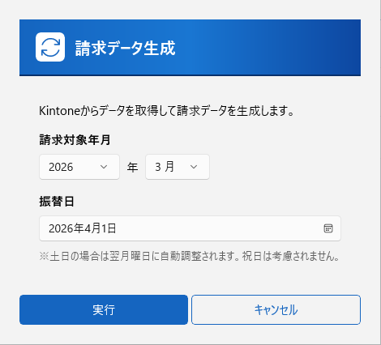
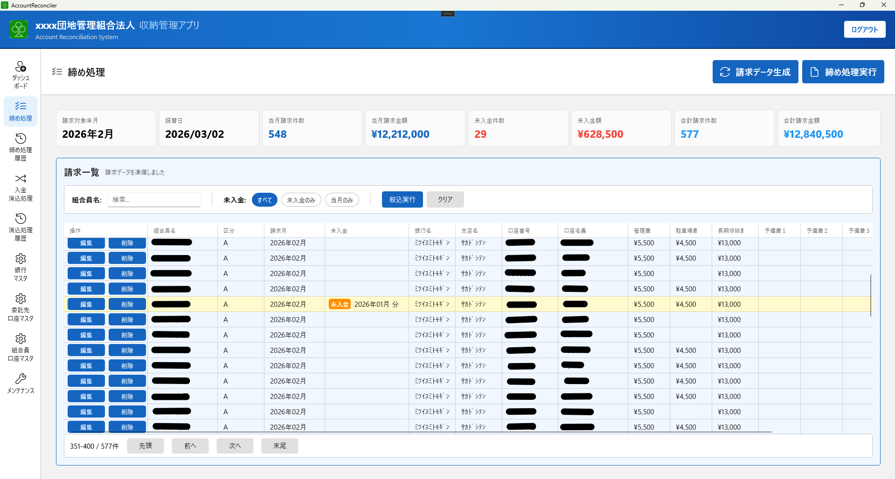
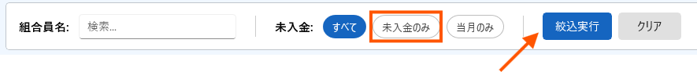
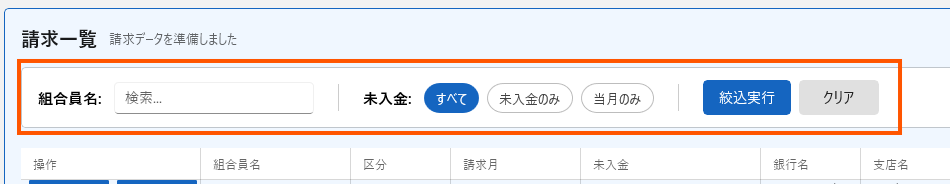
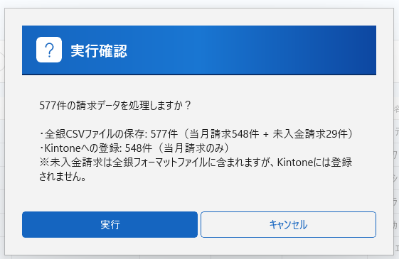
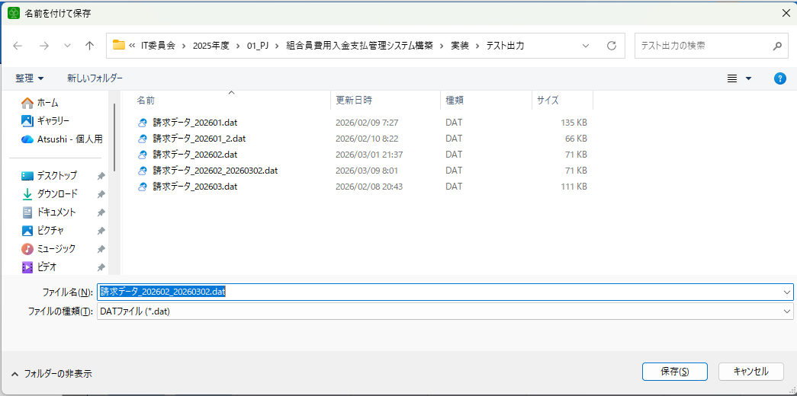
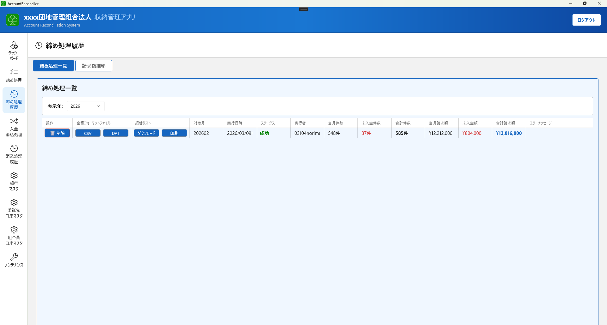

# 第3章 月次締め処理

毎月の組合費請求データを生成し、銀行への振替依頼ファイル（全銀ファイル）を作成します。

**実施タイミング：** 振替日の5〜7日前（銀行の締切に合わせて実施）

---

## 締め処理の全体手順

```
1. 締め処理画面を開く
   ↓
2. 対象年月・振替日を確認
   ↓
3. 「請求データ生成」をクリック
   ↓
4. 生成されたデータを確認・修正
   ↓
5. 「締め処理実行」をクリック
   ↓
6. 全銀ファイルを保存
   ↓
7. ファイルを銀行に提出
```

---

## 3-1. 締め処理画面を開く

左側メニューから **「締め処理」** をクリックします。



---

## 3-2. 対象年月・振替日を確認


---

## 3-2. 請求データを生成する

1. 画面上部の **「請求データ生成」** ボタンをクリックします



2. 請求データ生成ダイアログが表示されるので、以下の項目を入力して実行ボタンをクリックします。

| 項目 | 内容 |
|--------|------|
| **請求対象年月** | 今回の請求対象となる年月 |
| **振替日** | 銀行への振替指定日 |

3. 処理中は画面にローディング表示が出ます（Kintoneからデータを取得して計算中）
4. 処理が完了すると、統計カードと請求一覧が更新されます



### 統計カードの見方

| カード | 内容 |
|--------|------|
| **当月請求件数** | 今月分の請求対象件数 |
| **当月請求金額** | 今月分の請求合計金額 |
| **未入金件数** | 過去月から繰り越された未入金件数 |
| **未入金額** | 過去月から繰り越された未入金合計額 |
| **合計請求件数** | 当月 + 未入金の合計件数（全銀ファイルに含まれる件数） |
| **合計請求金額** | 当月 + 未入金の合計金額 |

> **未入金件数・未入金額が表示されている場合**
> 前月以前に入金されなかった分が今回の振替に含まれています。
> 「未入金のみ」フィルターで該当者を確認できます。



---

## 3-3. 請求データを確認・修正する

### 一覧の確認

生成された請求一覧に以下が表示されます。

| 列名 | 内容 |
|------|------|
| 組合員名 | 請求対象の組合員名 |
| 物件タイプ | 所有物件の種別 |
| 請求月 | 請求対象月 |
| 未入金 | 前月以前からの繰越の場合、元の請求月が表示される |
| 銀行・支店・口座番号・口座名義 | 振替先の口座情報 |
| 管理費 | 管理費の請求額 |
| 駐車場代 | 駐車場代の請求額 |
| 修繕積立費 | 修繕積立費の請求額 |
| 予備費（×4） | その他の費用 |
| 当月請求額 | 合計請求金額 |

### フィルターで絞り込む



| フィルター | 内容 |
|----------|------|
| 組合員名キーワード | 名前の一部でフィルター |
| 未入金 | 「全て」「未入金のみ」「当月のみ」から選択 |

**「絞込実行」** で適用、**「クリア」** でリセットします。

### 個別に修正する

請求内容に誤りがある場合は、各行の **「編集」** ボタンから修正できます。

> **Kintoneのデータが誤っている場合は、Kintone側を修正してから「請求データ生成」を再実行してください。**
> システム上の編集は一時的なもので、Kintoneには反映されません。

---

## 3-4. 締め処理を実行する

1. 内容を確認したら、画面上部の **「締め処理実行」** ボタンをクリックします
2. 確認ダイアログが表示されます。内容を確認して **「実行」** をクリックします



3. 処理中はローディング表示が出ます
4. 処理完了後、全銀ファイルの保存ダイアログが表示されます



### ファイル形式について

全銀ファイルには2種類の形式があります。

| 形式 | 拡張子 | 用途 |
|------|--------|------|
| CSV形式 | `.csv` | 多くの銀行のインターネットバンキングで使用 |
| 固定長形式 | `.dat` | 一部の銀行で必要な形式 |

この処理では、固定長形式のファイルが出力されます。
ここで生成された全銀ファイルは後述の締め処理履歴からダウンロードできます。

### ファイル名の規則

生成されるファイル名は以下の形式です：

```
請求データ_YYYYMM_YYYYMMDD.csv  （例：請求データ_202502_20250302.csv）
```
> YYYYMM：請求月、YYYYMMDD：振替指定日
---

## 3-5. ファイルを保存して銀行に提出する

1. ファイル保存ダイアログで保存先フォルダを選択します
2. **「保存」** をクリックするとファイルが保存されます
3. 保存したファイルを、銀行のインターネットバンキングまたは指定の方法で提出します

> **ファイルの取り扱いに注意してください。**
> 全銀ファイルには口座番号・口座名義など個人情報が含まれています。
> 提出後は適切に管理（不要になったら削除）してください。

---

## 3-6. 処理結果の確認

締め処理が完了すると、左側メニューの **「締め処理履歴」** から実行履歴を確認できます。

- 実行日時・対象年月・処理件数・合計金額が記録されます
- 全銀ファイル・振替リスト（Excel形式）のダウンロード・印刷も履歴画面から可能です



---

## よくある確認事項

| 確認内容 | 確認場所 |
|---------|---------|
| 請求件数がKintoneの組合員数と大きく異なる | 組合員口座マスタに全員登録されているか確認 |
| 委託先口座に関するエラーが出る | 委託先口座マスタで「有効」状態を確認 |
| 特定の組合員が一覧に出ない | 組合員口座マスタにその組合員のKintoneIDが登録されているか確認 |
| 金額が予想と異なる | Kintone上の管理費・修繕積立費・駐車場契約の内容を確認 |

---

[← 前章：初期設定](02_initial_setup.md) ｜ [次章：入金消込処理 →](04_reconciliation.md)
