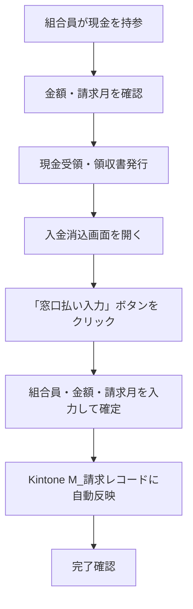
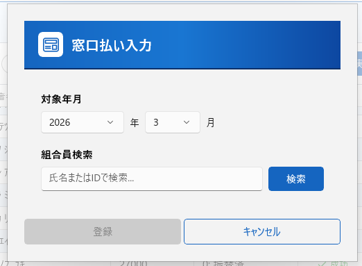
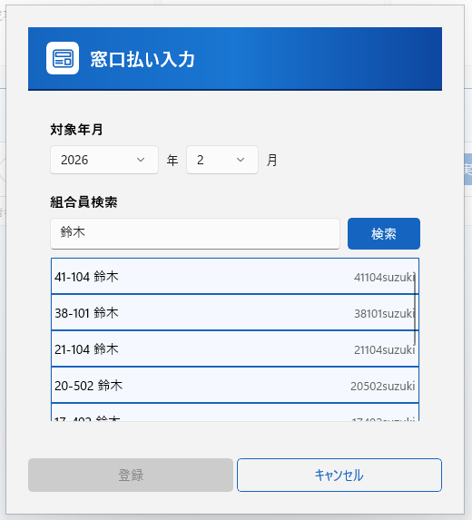
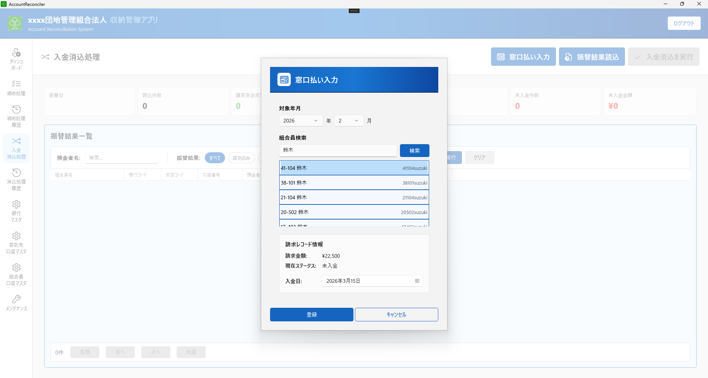
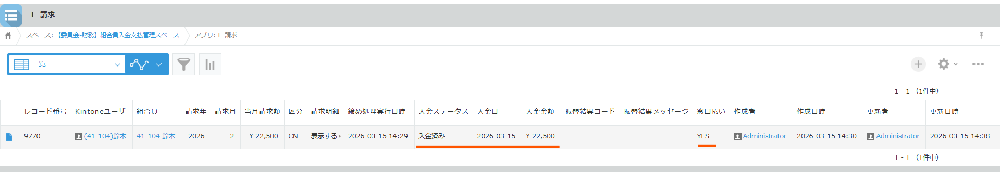

# 第4章補足 窓口払いの処理

## 概要

**窓口払い**とは、組合員が事務局に直接現金を持参して組合費を支払う方法です。
銀行振替（全銀ファイル）を使わずに入金を受け付けるため、**ローカルアプリの入金消込画面から手動で登録**する必要があります。

| 方式 | 処理経路 |
|------|----------|
| 銀行振替 | 銀行 → 振替結果CSV → 自動消込 |
| **窓口払い** | **現金受領 → アプリに手動入力 → Kintone自動反映** |

---

## 処理の流れ

---

## 手順1: 現金受領と領収書発行

1. 組合員から請求月・金額を確認する
2. 現金を受領し、金額が請求額と一致することを確認する
3. 領収書を発行して組合員に渡す

> **ポイント**: 請求月を必ず確認してください。複数月分をまとめて持参する場合は、月ごとに分けて記録します。

---

## 手順2: 入金消込画面を開く

1. ローカルアプリを起動し、左メニューから **「入金消込処理」** を選択する

---

## 手順3: 窓口払い入力ボタンから登録

1. 画面上の **「窓口払い入力」** ボタンをクリックする
2. 入力ダイアログが開いたら、対象年月を入力し、組合員を検索・選択する

| 項目 | 内容 |
|------|------|
| 対象年月 | 入金対象の請求月を選択 |
| 組合員検索 | 対象の組合員を検索（棟番号-部屋番号、姓で検索できます） |

対象の組合員を一覧上でクリックして選択します。

未入金請求のある組合員であれば、入金日の入力します。

| 項目 | 内容 |
|------|------|
| 入金日 | 入金した日を入力 |

4. 内容を確認して **「登録」** ボタンをクリックする

---

## 手順4: 結果確認

1. Kintone の **M_請求レコード** アプリを開き、該当レコードの入金状態が更新されていることを確認する

---

## 注意事項

- **二重計上について**: 入金済みの場合は、登録できません。
- **複数月分の支払い**: 2か月以上まとめて支払いを受ける場合は、月ごとに1件ずつ「窓口払い入力」を行ってください。

---

## よくあるミス

| ミスの内容 | 対処方法 |
|-----------|----------|
| 請求月を誤って入力した | システム管理者に取消しを依頼し、正しい月で再登録する |
| 金額が請求額と異なる | 差額が発生している場合は、組合員に確認してから登録する |
| 同じ月に重複登録した | システム管理者に重複分の取消しを依頼する |
