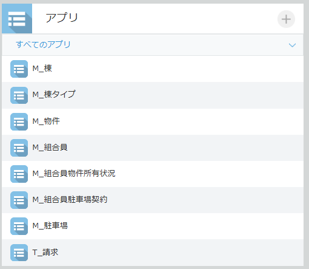
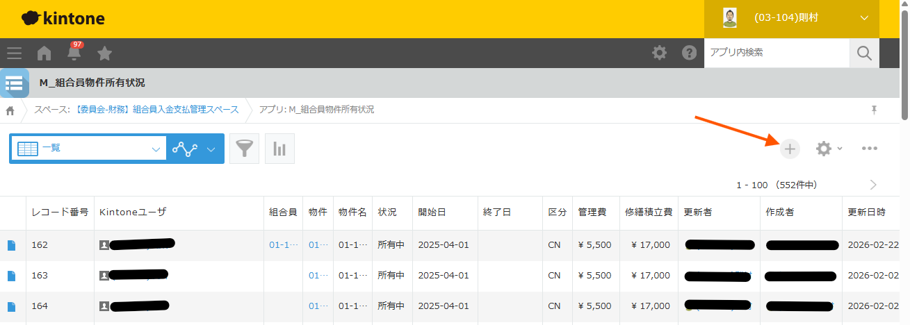
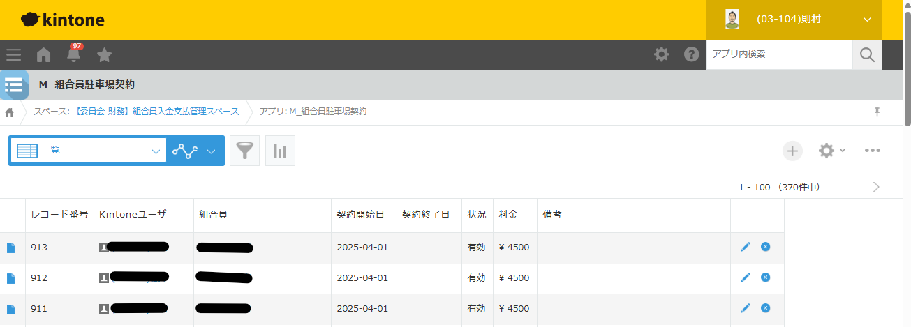

# 第7章 Kintone操作

組合員の入居・退去・各種変更に際して必要なKintone側の操作手順を説明します。

---

## 7-1. Kintoneとシステムの役割分担

| 操作 | 場所 | 担当 |
|------|------|------|
| Kintoneユーザー登録 | Kintone管理画面 | システム管理者（依頼して対応してもらう） |
| 組合員マスタ登録・変更 | **M_組合員** アプリ | 組合担当者 |
| 物件所有状況の登録・変更 | **M_組合員物件所有状況** アプリ | 組合担当者 |
| 駐車場契約の登録・変更 | **M_組合員駐車場契約** アプリ | 組合担当者 |
| 口座情報の登録・変更 | 本システム（→[第5章](05_master_management.md)） | 組合担当者 |

> **Kintoneへのログイン**
> Kintoneには別途ブラウザからアクセスしてください。
> 本システムはKintoneのデータを読み取り・書き込みしますが、マスタデータの登録・変更はKintone上で直接行う必要があります。

---

## 7-2. 入居時の手順

新しい組合員が入居した際の手順です。
> 同一人物が複数物件を所有する場合は、別の組合員として登録するので、本手順を踏みます。

```
1. システム管理者へKintoneユーザー登録を依頼する
   ↓
2. ユーザー追加の連絡を受けたら M_組合員 に登録する
   ↓
3. M_組合員物件所有状況 に登録する
   ↓
4. 駐車場を利用する場合は M_組合員駐車場契約 に登録する
   ↓
5. 本システムで口座情報を登録する（→第5章）
```

---

### ステップ1：システム管理者へのユーザー登録依頼

**システム管理者に以下を伝えてください：**
- 追加する人物の氏名（ふりがな）、棟-部屋番号
- （任意）パスワード再発行に使用するメールアドレス（またはログインID）

ユーザーが追加されたら、システム管理者から通知を受け取ります。
通知を受け取ってからステップ2に進んでください。

> **ユーザーが追加される前にKintoneデータを登録しないでください。**
> M_組合員・物件所有状況・駐車場契約はすべてKintoneユーザーと紐付けて登録するため、先にユーザーが存在している必要があります。

---

### ステップ2：M_組合員 への登録

Kintoneの **「M_組合員」** アプリを開き、新規レコードを追加します。




| フィールド | 入力内容 |
|-----------|---------|
| Kintoneユーザー | システム管理者が追加したKintoneユーザーを選択 |
| 表示 | {棟番号}-{部屋番号} 姓 |
| 状況 | 有効を選択 |
| 氏名 | 組合員の氏名を入力（任意） |

---

### ステップ3：M_組合員物件所有状況 への登録

Kintoneの **「M_組合員物件所有状況」** アプリを開き、新規レコードを追加します。



| フィールド | 入力内容 |
|-----------|---------|
| 組合員 | 対象のKintoneユーザーを選択 |
| 物件 | 「M_物件」から対象物件を選択 |
| 開始日 | 入居日（所有開始日）を入力（例：2025/04/01） |
| 終了日 | **空欄のまま**（継続中のため） |
| 状況 | 「所有中」を選択 |

> **開始日の重要性**
> 締め処理では「開始日 ≤ 対象月の末日」かつ「終了日 ≥ 対象月の初日（または終了日が空欄）」のレコードが請求対象になります。
> 入居日を正確に入力してください。入力した開始日が含まれる月から請求が始まります。

---

### ステップ4：M_組合員駐車場契約 への登録（駐車場利用の場合）

Kintoneの **「M_組合員駐車場契約」** アプリを開き、新規レコードを追加します。



| フィールド | 入力内容 |
|-----------|---------|
| 組合員 | 対象のKintoneユーザーを選択 |
| 駐車場代 | 月額駐車場代を入力 |
| 契約開始日 | 駐車場契約の開始日を入力 |
| 契約終了日 | **空欄のまま**（継続中のため） |

> 1人の組合員が複数の駐車場を契約している場合は、1契約につき1レコードを追加します。

---

### ステップ5：本システムで口座情報を登録

→ [第5章 5-3. 組合員口座マスタ「組合員口座を新規登録する」](05_master_management.md#組合員口座を新規登録する) を参照してください。

---

## 7-3. 退去時の手順

組合員が退去した際の手順です。

```
1. M_組合員の「状況」を退去状態に変更する
   ↓
2. M_組合員物件所有状況の「終了日」を設定し「状況」を変更する
   ↓
3. 駐車場を利用していた場合は M_組合員駐車場契約 の「契約終了日」を設定する
   ↓
4. 本システムで組合員口座を「無効化」する（→第5章）
```

> **終了日の設定を忘れないでください。**
> 終了日を設定しないと、翌月以降も請求対象として計算されてしまいます。
> 締め処理を実行する前に必ず設定してください。

---

### ステップ1：M_組合員 の状況変更

Kintoneの **「M_組合員」** アプリで対象組合員のレコードを編集します。

| フィールド | 変更内容 |
|-----------|---------|
| 状況 | 退去・無効を示す値に変更（例：「退去」） |

---

### ステップ2：M_組合員物件所有状況 の終了日設定

Kintoneの **「M_組合員物件所有状況」** アプリで対象レコードを編集します。

| フィールド | 変更内容 |
|-----------|---------|
| 終了日 | 退去日（所有終了日）を入力（例：2025/03/31） |
| 状況 | 「譲渡済」または退去を示す値に変更 |

> **終了日の設定例**
> 月末退去の場合（例：3月末退去）：終了日に「2025/03/31」を入力。
> 3月の締め処理では請求対象になり、4月以降はなりません。

---

### ステップ3：M_組合員駐車場契約 の終了日設定（駐車場利用の場合）

Kintoneの **「M_組合員駐車場契約」** アプリで対象レコードを編集します。

| フィールド | 変更内容 |
|-----------|---------|
| 契約終了日 | 駐車場契約終了日を入力 |

---

### ステップ4：本システムで口座を無効化

→ [第5章 5-3. 組合員口座マスタ「口座を無効化する」](05_master_management.md#口座を無効化する) を参照してください。

---

## 7-4. 各種変更時の手順

### 駐車場の解約（継続中の契約を終了する）

Kintoneの **「M_組合員駐車場契約」** で対象レコードを編集します。

| フィールド | 変更内容 |
|-----------|---------|
| 契約終了日 | 解約日を入力 |

### 駐車場の新規追加

Kintoneの **「M_組合員駐車場契約」** に新規レコードを追加します。
（→ 7-2 ステップ4 の手順と同様）

### 駐車場代の金額変更

**変更前後で期間を分けて管理する場合（推奨）：**

1. 旧契約レコードの「契約終了日」に変更前最終日を設定
2. 新しい金額で新規レコードを追加（「契約開始日」に変更日を設定）

**旧レコードを直接書き換える場合：**
1. 対象レコードの「駐車場代」を新しい金額に変更
2. 変更は次回の締め処理から適用されます

### 管理費・修繕積立費の金額変更

Kintoneの **「M_組合員物件所有状況」** で対象レコードを編集します。

| フィールド | 変更内容 |
|-----------|---------|
| 管理費 | 新しい月額管理費を入力 |
| 修繕積立費 | 新しい月額修繕積立費を入力 |

> 変更は次回の締め処理から適用されます。
> 棟タイプ全体で金額が変わる場合は、そのタイプに属する全組合員のレコードを変更してください。

### 口座情報の変更

Kintone側の操作は不要です。
→ [第5章 5-3. 組合員口座マスタ「口座情報を変更する」](05_master_management.md#口座情報を変更する) を参照してください。

---

## 7-5. Kintoneアプリのフィールド一覧（参考）

### M_組合員

| フィールド名 | 説明 |
|------------|------|
| ユーザー | KintoneユーザーID（必須） |
| 状況 | 在住・退去などの状態（必須） |
| 氏名 | 組合員の氏名 |
| 表示 | 表示名 |

### M_組合員物件所有状況

| フィールド名 | 説明 |
|------------|------|
| 組合員 | KintoneユーザーID（必須） |
| 物件 | M_物件への参照（必須） |
| 開始日 | 所有開始日（必須）— 請求開始日に影響 |
| 終了日 | 所有終了日（任意）— 未設定で継続中とみなされる |
| 状況 | 所有中・譲渡済など（必須） |
| 管理費 | 月額管理費（必須）— 締め処理で請求計算に使用 |
| 修繕積立費 | 月額修繕積立費（必須）— 締め処理で請求計算に使用 |

### M_組合員駐車場契約

| フィールド名 | 説明 |
|------------|------|
| 組合員 | KintoneユーザーID（必須） |
| 駐車場代 | 月額駐車場代（必須）— 締め処理で請求計算に使用 |
| 契約開始日 | 契約開始日（必須）— 請求開始日に影響 |
| 契約終了日 | 契約終了日（任意）— 未設定で継続中とみなされる |

### M_物件（参照用）

| フィールド名 | 説明 |
|------------|------|
| 物件名 | 物件の名称 |
| 号棟 | M_棟への参照 |
| 部屋番号 | 部屋番号 |

### M_棟・M_棟タイプ（参照用）

| フィールド名 | 説明 |
|------------|------|
| 号棟（M_棟） | 棟名称 |
| M_棟タイプ（M_棟） | 棟タイプへの参照 |
| 棟タイプ名（M_棟タイプ） | タイプ名称 |
| 管理費（M_棟タイプ） | 標準管理費（M_組合員物件所有状況に転記して使用） |
| 修繕積立費（M_棟タイプ） | 標準修繕積立費（同上） |

---

[← 前章：バックアップ・メンテナンス](06_maintenance.md) ｜ [次章：トラブルシューティング →](08_troubleshooting.md)
