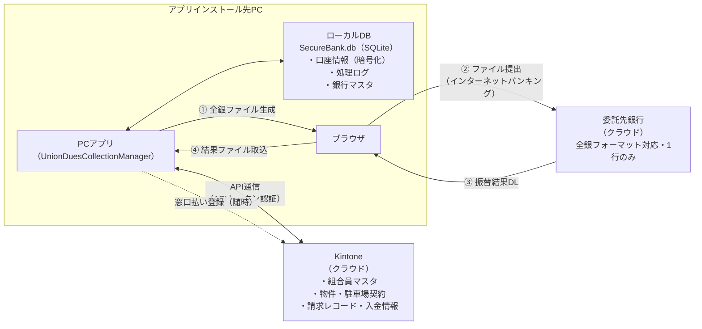
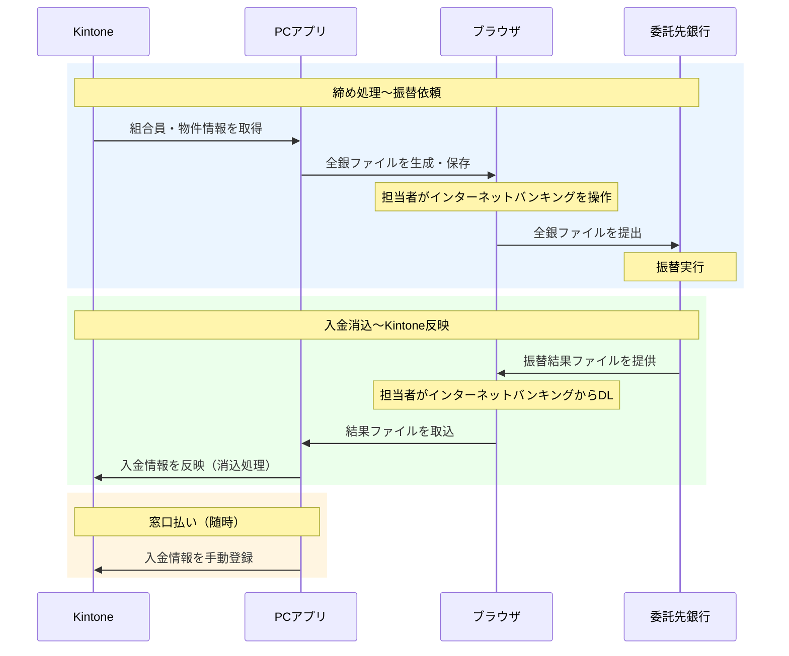

# システム概要

---

## システム構成

このシステムは、**PCにインストールされたアプリ**と**Kintone（クラウド）**の2つが連携して動作しています。
また、銀行への全銀ファイル提出・振替結果の取込はブラウザ（インターネットバンキング）を経由して行います。

> **対応銀行について**：全銀フォーマットに対応している銀行であれば利用できます。ただし、委託先銀行は1行のみ設定可能です。

---

## 月次業務でのデータの流れ

---

## 各コンポーネントの役割

| | PCアプリ | Kintone | ブラウザ |
|---|---|---|---|
| **何をするか** | 計算処理・ファイル生成・データ管理の操作画面 | データの保管・共有 | 銀行との全銀ファイルのやりとり |
| **保存しているデータ** | 組合員の銀行口座情報（暗号化）・処理ログ・銀行マスタ | 組合員情報・物件・駐車場契約・請求・入金履歴 | （保存なし） |
| **操作者** | 事務局スタッフ（このシステム） | 事務局スタッフ（Kintone画面） | 担当者（インターネットバンキング） |

---

## この構成を知っておくと役立つ場面

- **請求内容がおかしい** → まずKintone側のデータ（組合員・物件・駐車場契約）を確認する
- **PCを新しくする** → PCアプリのデータ（口座情報）を移行する必要がある（→ [運用マニュアル 第6章](../運用マニュアル/06_maintenance.md)）
- **ログインできない** → Kintoneのドメイン・ID・パスワードを確認する
- **処理結果をほかのスタッフが確認したい** → Kintoneにアクセスすれば別のPCからも閲覧できる
- **振替がうまくいかない** → インターネットバンキング側の操作（ファイル形式・アップロード手順）を確認する

---

[← 前提知識](00_prerequisites.md) ｜ [← 目次へ](index.md)
